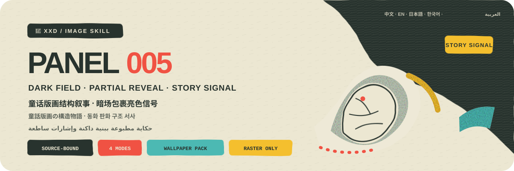
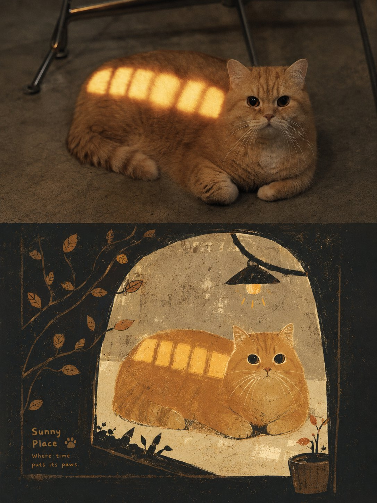
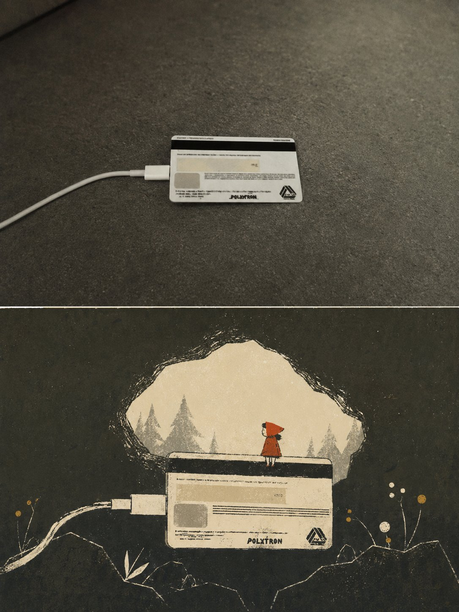
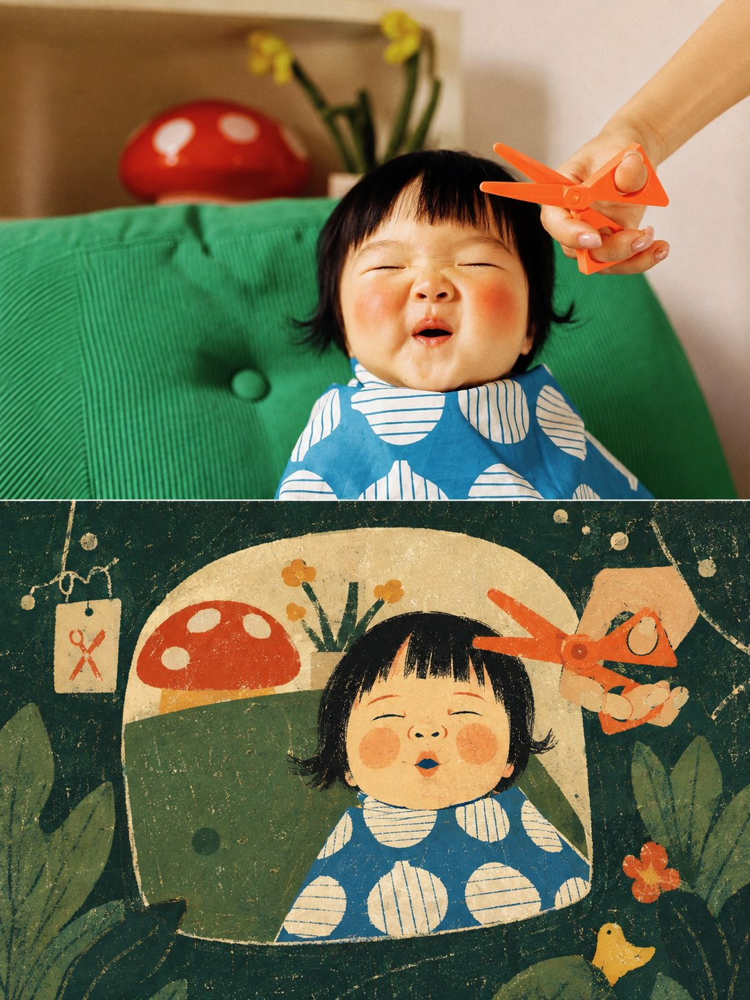
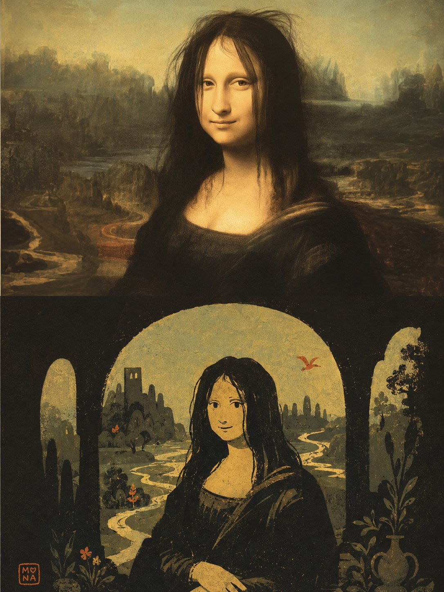

<p align="center">
  
</p>

<div align="center" dir="rtl">

# 🦁 XXD Panel 005

### يحوّل الصورة إلى حكاية مطبوعة ببنية داكنة وإشارات لونية صغيرة ساطعة

[](./SKILL.md)
[](#أربعة-مخرجات-ومنطق-طباعي-واحد)
[](#الحدود-والثقة)

<a href="README.md">简体中文</a> · <a href="README.en.md">English</a> · <a href="README.ja.md">日本語</a> · <a href="README.ko.md">한국어</a> · <strong>العربية</strong>

</div>

<div dir="rtl">

> كتل غليظة · حقل بنيوي داكن · كشف جزئي · ترتيب لوني ثلاثي · طباعة حريرية × باستيل

XXD Panel 005 مهارة لتوليد الصور مخصّصة لـ Codex والوكلاء المتوافقين. تحافظ على الهوية والحركة والوظيفة والعاطفة الحقيقية في الصورة، وتضغط الموضوع إلى كتلة أو كتلتين غليظتين قابلتين للتعرّف، ثم تنمّي حقلاً بنيوياً داكناً من فضاء المصدر ومعناه. يصنع الحجب والقص والابتلاع والكشف الجزئي سرداً يشبه الحكاية المطبوعة.

يلتزم اللون بثلاث طبقات: بنية داكنة تحمل الوزن، وفراغ فاتح يمنح التنفس، ومساحات مشبعة صغيرة جداً لا تشير إلا إلى وجه أو وضعية أو مسار أو نقطة وظيفية أو بؤرة سردية. تجمع الخامة بين الطباعة الحريرية المسطحة والباستيل المسحوق، مع فرشاة جافة وحبيبات وملمس ورق ورذاذ وبياض متقطع وانزياح تسجيل طفيف. ولا يظهر النص إلا كلافتة صغيرة أو لوحة على جسم أو ملاحظة طرفية.

## لماذا توجد 005؟

يتحوّل «أسلوب الحكايات» بسهولة إلى كرتون لطيف عام: خلفية داكنة، وألوان ساطعة موزعة بالتساوي، ثم قلاع ونجوم ووجوه مبتسمة تُلصق كي تبدو الصورة كأنها قصة.

تعكس 005 هذا الترتيب:

```text
تثبيت حقائق المصدر ← ضغط الموضوع إلى كتلة أو كتلتين غليظتين ← إنماء حقل داكن من المصدر ← السرد بالحجب والكشف الجزئي ← تثبيت أدوار الداكن والفاتح والمشبع ← الإنهاء بالطباعة الحريرية والباستيل المسحوق
```

إذا أمكن استبدال المصدر بصورة لا صلة لها من دون تغيير جوهري في الكتل أو وظيفة الحقل الداكن أو منطق الحجب أو الإشارات الساطعة أو النص، فالنتيجة ليست 005.

## العقد البصري لـ 005

- **كتلة أو كتلتان غليظتان:** تحافظ ثلاث علامات خاصة بالمصدر على الأقل على الهوية والحركة والوظيفة والعاطفة.
- **حقل داكن ينمو من المصدر:** تعمل بنية كبيرة منخفضة القيمة بوضوح كحاوية أو مسار أو إطار أو غلاف كثافة.
- **سرد بنيوي:** ينظم الحجب والقص والابتلاع والكشف الجزئي ترتيب المعلومات.
- **منظور صفحة مسطحة:** يُختار جهاز واحد مناسب، مثل ضغط المنظور العلوي أو الحركة الجانبية أو الإطار الأمامي أو توجيه المسار أو قفزة المقياس أو قص الحافة.
- **ترتيب لوني ثلاثي:** يمنح الداكن الوزن، والفاتح التنفس، والإشارات المشبعة الصغيرة طريق القراءة والقصة.
- **خط وظيفي مقتصد:** لا يظهر الخط إلا للوظيفة والمسار والحدود والملمس والتعرّف.
- **طباعة حريرية × باستيل:** تحتفظ الكتل المسطحة بآثار الفرشاة الجافة والحبيبات وملمس الورق والرذاذ والبياض المتقطع وانزياح التسجيل.
- **نص داخل البنية:** يُعامل كلافتة صغيرة مستديرة وغليظة ومنخفضة الكثافة، أو لوحة جسم، أو ملاحظة طرفية.

## النماذج · من X

> [Xiaoxiaodong (@xiaoxiaodong01)](https://x.com/xiaoxiaodong01/status/2089987808664719723) · 2026-08-19<br>
> GPT2 x 格林童话 x 转绘 x 童趣 x 美学提示词 x VOL.005

<table>
  <tr>
    <td width="50%"><a href="https://x.com/xiaoxiaodong01/status/2089987808664719723"></a></td>
    <td width="50%"><a href="https://x.com/xiaoxiaodong01/status/2089987808664719723"></a></td>
  </tr>
  <tr>
    <td width="50%"><a href="https://x.com/xiaoxiaodong01/status/2089987808664719723"></a></td>
    <td width="50%"><a href="https://x.com/xiaoxiaodong01/status/2089987808664719723"></a></td>
  </tr>
</table>

<p align="center"><a href="https://x.com/xiaoxiaodong01/status/2089987808664719723">عرض المنشور الأصلي والتوجيه كاملاً ←</a></p>

تعرض هذه النماذج الدافع الجمالي للإصدار 005 فقط؛ ولا تصبح موضوعاتها أو تكوينها أو ألوانها أو نصوصها أو نسبة اللوحة السابقة مراجع للتوليد أو إعدادات افتراضية حالية.

## أربعة مخرجات قابلة للجمع

يمكن اختيار نمط واحد أو عدة أنماط بـ `1` أو `1+3` أو `1,2,4` أو `الكل`؛ وينتج «الكل» سبعة ملفات PNG مستقلة لكل مصدر. بعد اختيار النمط وقبل التوليد، تُحسم نسبة لوحة الناتج كاملة: `3:4` الخاصة بالتوجيه الأصلي، أو نسبة المصدر باختيار صريح، أو نسبة شائعة، أو نسبة／بكسلات مخصصة. لا تُطبّق أبعاد المصدر ضمنياً.

| النمط | قاعدة اللوحة | الناتج |
| --- | --- | --- |
| `top-bottom` | لوحة نهائية أكدها المستخدم | توليد كامل واحد: المصدر عالي الوفاء في الأعلى وتصميم 005 في الأسفل، نحو 50/50 |
| `left-right` | لوحة نهائية أكدها المستخدم | توليد كامل واحد: المصدر عالي الوفاء يساراً وتصميم 005 يميناً، نحو 50/50 |
| `design-only` | لوحة نهائية أكدها المستخدم | يملأ تصميم 005 اللوحة ولا تظهر صورة المصدر |
| `wallpaper-pack` | تأكيد مستقل لكل جهاز | ملفات PNG منفصلة للهاتف وiPad والحاسوب وساعة الأطفال |

تستخدم الأنماط الثنائية المصدر كمدخل تحرير／مرجع عالي الوفاء، وتولّد التكوين النهائي مباشرة بتوجيه الأسلوب الكامل كي تتماسك الصورة والتصميم واللون والضوء والكتابة والمعنى. ولا يُستخدم التركيب الحتمي إلا بعد فشل إعادة محاولة محددة للوحة الكاملة، أو عند طلب حفظ المصدر بكسلاً ببكسل، أو عجز مسار التوليد عن تحقيق اللوحة، أو للحاجة إلى معايرة نهائية بلا فقد.

يمكن أن تكون الخلفيات مترابطة أو مستقلة. تعتمد المترابطة عملاً مرجعياً واحداً لـ iPad ثم تعيد تكوين كل جهاز من الأصل والمرجع نفسه. أما المستقلة فيرجع كل جهاز فيها إلى الأصل وحده. ولا يقص أي منهما ناتج جهاز آخر ولا يسلسل المشتقات.

## يجب أن يصبح النص جزءاً من البنية المطبوعة

قبل التوليد، اختر نصاً تلقائياً أو نصاً مخصصاً أو نتيجة بلا نص. عند وجود نص، حدّد اللغة أو المنطقة المستهدفة.

يستخلص النص التلقائي كلمة أو عبارة قصيرة من هوية الموضوع أو حركته المرئية أو وظيفته أو علاقته أو مكان معروف أو السرد البنيوي الذي يؤديه الحقل الداكن. يجب أن يرتبط بهذه الصورة تحديداً من دون اختلاق حكاية أو فرض تلاعب لفظي أو انقلاب.

العنوان الواحد هو الإعداد الافتراضي. لا تُضاف من صفر إلى ملاحظتين قصيرتين إلا حين تحملان معلومة حقيقية، ولا تُختلق أرقام أو سنوات أو إحداثيات أو ملصقات أرشيفية لمجرد إظهار الرقي.

يحافظ على النص النهائي الذي يقدمه المستخدم حرفياً. أما الاتجاه الإبداعي أو المسودة القابلة للتحرير فلا تُصقل إلا مع الحفاظ على الجمهور والهدف والكلمات الإلزامية والنبرة والدلالة.

تتبع اللغة الجمهور المقصود لا لغة الأمر:

```text
السوق أو الجمهور المستهدف > لغة الناتج المحددة > لغة التوجيه؛ وإذا غابت كلها يُسأل المستخدم قبل التوليد
```

تستخدم النسخة اليابانية يابانية طبيعية، والنسخة الكورية كورية طبيعية بمسافات صحيحة، والنسخة البريطانية إنجليزية بريطانية، وتستخدم العربية افتراضياً العربية الفصحى المعاصرة مع تركيب حقيقي من اليمين إلى اليسار. لا تستنتج المهارة الجنسية من الوجه أو الملابس أو المشهد أو اللافتات، ولا تستخدم نصاً أجنبياً زائفاً للزينة.

## أولوية اللوحة الكاملة وحدود الصورة النقطية

يتولى نموذج الصور إعادة البناء الجمالي للعمل النهائي كله، وتستخدم التركيبات الثنائية أيضاً توليد لوحة كاملة واحدة افتراضياً. ولا يبقى `scripts/compose_panel.py` إلا للاسترداد المشروط ومعايرة البكسلات بلا فقد والتدقيق للقراءة فقط؛ فلا يعمل مسبقاً ولا يحكم على النجاح الجمالي.

كل التسليمات ملفات PNG نقطية، وينشئ كل استدعاء مهمة جديدة تحت `~/Desktop/xxd/`. ولا يكشف مسار الصور المضبوط سوى حالة منزوعة التفاصيل، من دون المزوّد أو نقطة الاتصال أو بيانات الاعتماد أو الرؤوس أو التوجيهات أو الاستجابات أو معلومات الحساب. ولا تصلح SVG أو HTML أو Canvas أو الرسوم البرمجية بديلاً للعمل النهائي.

## عناصر اختيار ومعاملات مضمنة

عندما توفّر بيئة التشغيل عناصر تفاعلية حقيقية، تفضّل المهارة بطاقات الاختيار: يمكن تحديد عدة أنماط وعدة مقاسات عادية، بينما يكون نمط النص وعلاقة الخلفيات اختياراً واحداً. تشمل المقاسات: الضبط التلقائي، ونسبة المصدر، و1:1 و3:4 و4:3 و4:5 و5:4 و2:3 و3:2 و9:16 و16:9 و21:9 و5:7 و7:5، إضافة إلى نسبة أو دقة مخصصة. وإذا لم تتوفر عناصر تفاعلية، تستخدم المهارة قائمة مرقمة واضحة متعددة الأسطر بدلاً من مربعات اختيار وهمية غير قابلة للنقر.

يمكن أيضاً تمرير كل الإعدادات كمتغيرات ضمن أمر الاستدعاء:

```text
/xxd-panel-005 photo.jpg --mode top-bottom,design-only --size auto,3:4,9:16 --text auto --locale ja-JP
```

تشمل المعاملات `--mode` و`--size` القابل للتكرار أو الفصل بالفواصل، و`--text auto|custom|none`، و`--locale`، و`--copy`، و`--wallpaper linked|independent`، و`--wallpaper-size`، و`--out`. عند اكتمال المعاملات تُتخطّى جميع أسئلة الإعداد ويبدأ التوليد مباشرة؛ وعند نقصها يُسأل فقط عن القيم الناقصة. تُعاد صياغة كل نسبة أبعاد بصورة مستقلة، وتبقى حزمة خلفيات الأجهزة الأربعة فرعاً مستقلاً لا يتضاعف آلياً مع المقاسات العادية.

## أولوية نموذج الصور

يظل GPT Image 2 الخيار الأول افتراضياً، مع الحفاظ على سير العمل الحالي: مرجع المصدر عالي الوفاء، وحسم اللوحة النهائية قبل التوليد، وتوليد اللوحة الثنائية كاملة في عملية واحدة، وعدم استخدام التركيب البرمجي إلا كحل احتياطي مشروط.

يمكن أيضاً استخدام Seedance 5.0 Pro أو Nano Banana Pro (Gemini Image Pro) أو Nano Banana 2 (Gemini Image Flash) أو نموذج نقطي متوافق آخر عندما يكون متاحاً فعلاً عبر الأدوات الحالية أو المسارات المضبوطة، وقادراً على تلبية وفاء المصدر ونسبة اللوحة النهائية ونص اللغة المستهدفة والمراجع المتعددة للخلفيات المترابطة. يغيّر النموذج البديل مسار التوليد فقط، ولا يغيّر الأنماط أو اللوحة أو النص أو اللغة أو علاقة الخلفيات أو أولوية اللوحة الكاملة.

إذا لم يوجد مسار مناسب، تطلب المهارة من المستخدم تفعيل أداة لتوليد الصور أو تقديم API Key. يمكن استخدام بيانات الاعتماد التي يقدمها المستخدم للمهمة الحالية من دون تكرارها أو عرضها أو تسجيلها أو كشفها. ولا تُحفظ طويلاً ولا تتغير إعدادات المزوّد أو الحساب أو الفوترة أو المسار العام إلا بطلب صريح من المستخدم.

## البدء

```bash
git clone https://github.com/nevertoday/xxd-panel-005.git
mkdir -p ~/.codex/skills
ln -s "$(pwd)/xxd-panel-005" ~/.codex/skills/xxd-panel-005
```

يمكن لمستخدمي Claude Code ربط المجلد نفسه بـ `~/.claude/skills/xxd-panel-005`. أعد تشغيل جلسة الوكيل بعد التثبيت.

```text
$xxd-panel-005
حوّل هذه الصورة إلى تكوين يسار/يمين، واستخرج العبارة من معناها، واكتبها بالعربية الفصحى المعاصرة.
```

يمكن أيضاً استدعاء المهارة بصورة وحدها. ستسأل أولاً عن نمط واحد أو عدة أنماط وعن إعداد النص في قائمة مرقمة متعددة الأسطر؛ ويسأل نمط الخلفيات أيضاً عن الترابط والمقاسات.

المواصفات الكاملة:

- [مسار عمل المهارة](SKILL.md)
- [التوجيه الصيني الكامل](references/xxd-panel-005-prompt.zh-CN.md)
- [التوجيه الإنجليزي الكامل](references/xxd-panel-005-prompt.en.md)
- [موجز الأسلوب الأصلي](references/005-source.md)

## الحدود والثقة

- تبقى كل صورة داخل مهمتها ولا تستعير موضوعاً أو لوناً أو نصاً أو تكويناً من مدخل آخر أو نتيجة قديمة أو نموذج.
- ينشئ كل استدعاء مجلد مهمة جديداً، حتى عند تكرار المصدر والمعلمات.
- النتائج ملفات PNG نقطية، وليست SVG أو HTML أو Canvas أو بديلاً مرسوماً برمجياً.
- لا يعرض جسر الصور المضبوط سوى حالة منزوعة التفاصيل، ولا يكشف المزوّد أو نقطة الاتصال أو الرؤوس أو بيانات الاعتماد أو التوجيه أو نص الاستجابة.
- يعيد كل نمط عادي مختار ملفاً واحداً، ويضيف اختيار `wallpaper-pack` أربع خلفيات مستقلة. يعيد خيار «الكل» سبعة ملفات PNG لكل مصدر داخل أربعة مجلدات أنماط متجاورة، ولا ينشئ لوحة تجميع أو عرضاً عاماً.

يحتاج التركيب المحلي إلى Python 3 وPillow. يستخدم الجسر الآمن `tomllib` في Python 3.11 أو أحدث. ويحتاج توليد الصور إلى قدرة نقطية مدمجة في الوكيل المضيف أو مسار نقطي متوافق ومضبوط مسبقاً.

## المستودع

```text
xxd-panel-005/
├── SKILL.md
├── README.md / README.en.md / README.ja.md / README.ko.md / README.ar.md
├── agents/openai.yaml
├── assets/banner.svg + examples/ (محجوز لنماذج محلية مستقبلية)
├── scripts/compose_panel.py + configured_imagegen.py
└── references/xxd-panel-005-prompt.zh-CN.md + xxd-panel-005-prompt.en.md + 005-source.md
```

## عن XXD

XXD هو الاختصار التجاري لاسم Xiaoxiaodong. أنشأ المشروع ويديره [@xiaoxiaodong01](https://x.com/xiaoxiaodong01).

## الدعم والعضوية

### استشارة متعمقة · 299 يواناً صينياً/ساعة

تبلغ تكلفة الاستشارة الفردية المتعمقة في استخدام Skills مقدار 299 يواناً صينياً في الساعة. للحجز، تواصل عبر رمز WeChat أدناه.

### مجموعة مستخدمي Xiaoxiaodong Skills · 99 يواناً صينياً

تتيح دفعة واحدة قدرها 99 يواناً الانضمام إلى مجموعة تبادل سير العمل ومناقشة الأعمال والدعم بين المستخدمين. ولا تشمل الاستشارة الفردية المحسوبة بالساعة.

### Knowledge Planet＋مكتبة توجيهات الأعضاء · 699 يواناً صينياً/سنة

[Knowledge Planet](https://wx.zsxq.com/group/15554814142882) و[مكتبة توجيهات XXD](https://vip.xiaoxiaodong.ai/) عضوية واحدة: **دفعة سنوية واحدة تفتح الخدمتين من دون شراء ثانٍ.**

1. اشترك عبر Knowledge Planet ثم تواصل عبر WeChat للحصول على رمز استبدال المكتبة.
2. اشترك عبر مكتبة التوجيهات ثم تواصل عبر WeChat للحصول على دعوة إلى Knowledge Planet.

<p align="center">
  <a href="https://xiaoxiaodong.pages.dev/assets/wechat-qr.png"></a>
</p>

<div align="center" dir="rtl">

**دع الحقل الداكن يخفي الضجيج، ودع الإشارة الصادقة وحدها تضيء الحكاية.**

</div>

</div>

---

<div align="center" dir="rtl">
  <h2>☕ ادعم هذا المشروع مفتوح المصدر</h2>
  <p>إذا وفّر عليك المشروع وقتاً، فإن نجمة أو مشاركة أو فنجان قهوة يساعد في استمراره.</p>
  <table><tr><td align="center" width="240">
    <a href="https://github.com/nevertoday/zhongguo-traditional-colors/blob/main/docs/images/buy-me-a-coffee-qr.png?raw=true"></a><br>
    <strong>Buy me a coffee</strong><br><sub>امسح رمز QR أو افتحه لدعم Xiaoxiaodong</sub>
  </td></tr></table>
  <p><sub>الدعم اختياري تماماً ولا يغيّر حق الوصول إلى هذا المشروع مفتوح المصدر.</sub></p>
</div>
